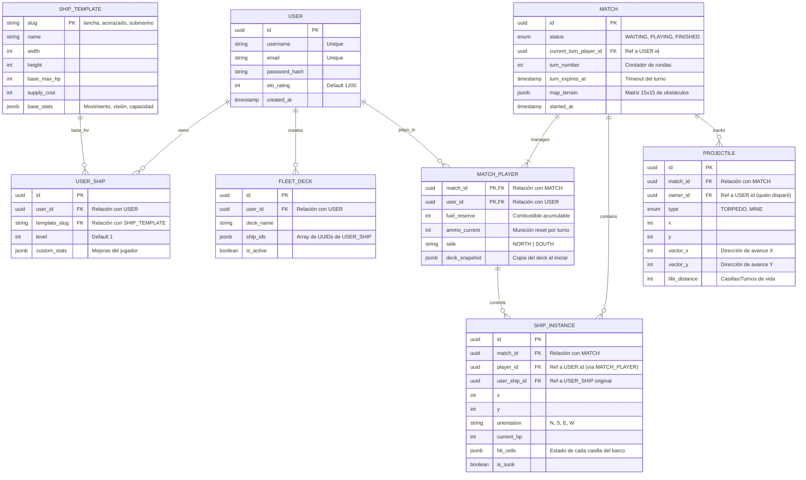

# DATABASE_MODEL

En el presente documento se presenta el modelo de datos que representaremos en posgresSQL. Vamos a presentar el diagrama E-R y algunos detalles técnicos.

## 1. Diagrama de Entidad-Relación

Se plantea el siguiente diagrama E-R, el cual modela la base de datos que interactuará con la lógica de negocio en el back-end e, indirectamente con el front-end.



---

## 2. Detalles Técnicos de Implementación

### A. El concepto de "Hit Cells" (Daño Localizado)
Se plantea este campo para contener varios estados de un barco, por ejemplo:
```json
{
  "0": {"status": "destroyed", "part": "engine", "move_penalty": 2},
  "1": {"status": "intact", "part": "bridge"},
  "2": {"status": "damaged", "part": "cannon", "atk_penalty": 0.5}
}
```
De esta forma el motor de juego puede calcular en cada turno los debuffs sumando los valores de este JSON.

### B. Doctrinas y Pasivas
El campo de doctrine_slug se enfoca de cara a almacenar las doctrinas elegidas por cada usuario, estas tienen modificadores globales durante el juego.

### C. Proyectiles Dinámicos
La tabla `Proyectile` sirve para identificar municiones que perduran en la partida (como torpedos o minas), estas tienen una localización exacta en el tablero, una trayectoria y una caducidad in-game.

### D. Usuario tiene un deck de barcos
En la tabla `MATCH_PLAYER` hay una snapshot del deck de cada jugador para guardarse tal y como se jugó la partida.

---

## 3. Tablas

A continuación se describe las principales tablas junto con unas pequeñas anotaciones sobre las intenciones de cada campo del sistema.

| Tabla | Campo FK | Referencia a | Propósito |
| :--- | :--- | :--- | :--- |
| `USER_SHIP` | `user_id` | `USER.id` | Saber quién es el dueño del barco. |
| `FLEET_DECK` | `user_id` | `USER.id` | Saber de quién es el mazo configurado. |
| `MATCH` | `current_turn_player_id` | `USER.id` | Indicar qué jugador tiene el permiso de mover. |
| `MATCH_PLAYER` | `match_id` | `MATCH.id` | Unir al jugador con la sesión de juego. |
| `SHIP_INSTANCE` | `user_ship_id` | `USER_SHIP.id` | Traer las stats y nivel del barco al tablero. |
| `PROJECTILE` | `owner_id` | `USER.id` | Atribuir la autoría del disparo (Torpedos/Minas). |

